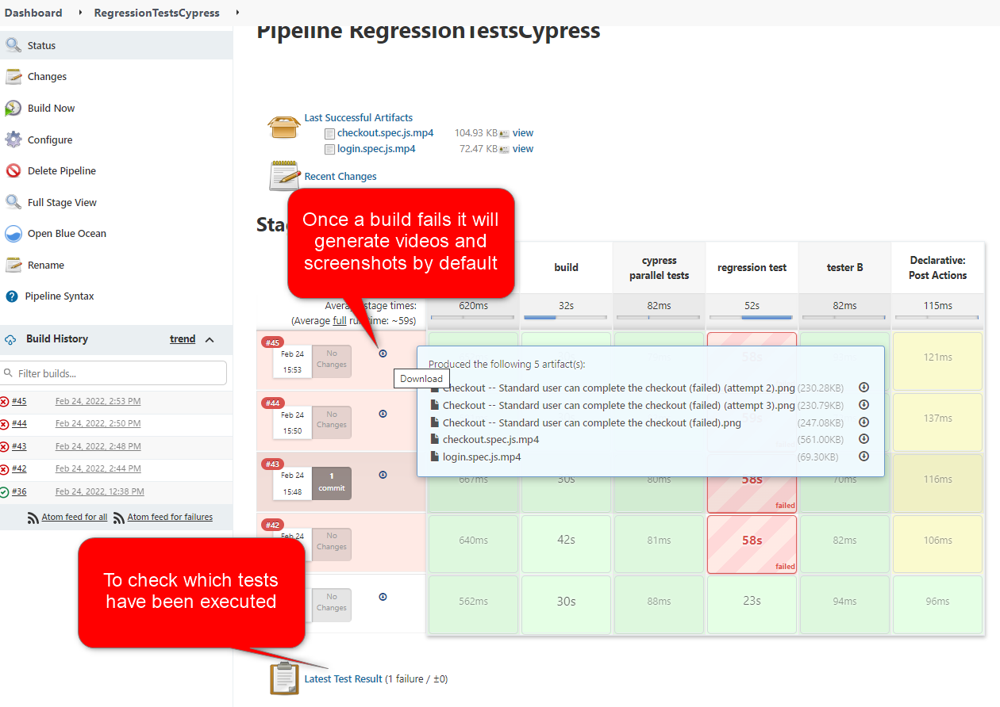
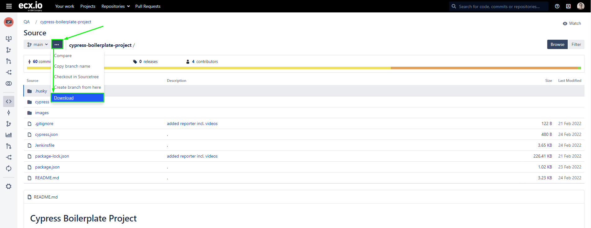
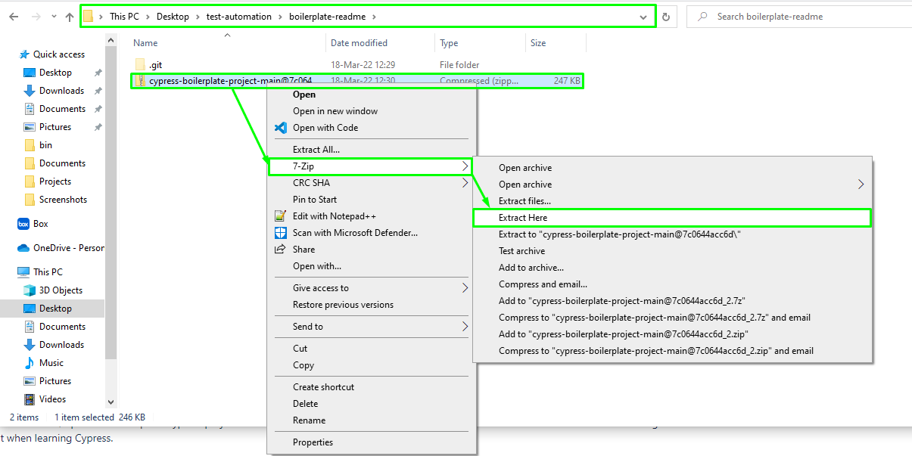

# Cypress Boilerplate Project

This repository is a minimal, optimized boilerplate Cypress project based on the Swag Labs playground site that includes tests for basic functionalities like login and checkout. It can be taken over and used as a starting point when setting up automated tests for a projects, or just as a reference point when learning Cypress.

## Prerequisites

- Node.js 12 or 14 and above (https://nodejs.org/en/download/)\
  Since the packages and dependencies are downloaded and used with NPM (Node Package Manager), it is necessary to install Node.js prior to using any Cypress features.

## Installation

1. Clone the repository with `git clone https://stash.ecx.io/scm/qa/cypress-boilerplate-project.git`
2. Navigate to the root of the repository
3. Install Cypress and other project dependencies with the terminal command `npm install`
4. Start Cypress or execute tests as described in the "Run Config" section of the readme

## Reporter

By default the project is using the mochawesome reporter. After running the tests the report will be genarated in the `cypress/report` folder.
On failed tests, a screenshot and video will be attached to the report.

## Structure

- tests are defined in the `cypress/integration` folder
- test steps and actions are implemented in the `cypress/support/actions` folder
- global commands can be found in `cypress/support/commands.js`
- environment-specific configuration can be found in `cypress/config/env`
- test data can be found in `cypress/fixtures`

## Run Config

The scripts used to execute Cypress tests are defined within `package.json` by using the following convention: **cy:environment:command**\
It is constructed with the following rules:

1. **cy** - general fixed prefix that defines the script as a Cypress one
2. **environment** - environment parameter that is directly corelated to the environments defined as JSON files in `cypress/config/env`
3. **command** - execution parameter that determines whether to **open** the Cypress Test Runner interface, or instead **run** the tests directly in the terminal with headless mode

Executing a script with a particular environment parameter, for example `uat`, will automatically load the appropriate configuration file (`cypress/config/env/uat.json`) as well as the fixture folder that contains test data appropriate for that environment (`cypress/fixtures/uat`).\
With that said, these are all of the available Cypress scripts within this repository.

- `cy:dev:open`
- `cy:qa:open`
- `cy:uat:open`
- `cy:dev:run`
- `cy:qa:run`
- `cy:uat:run`

In order to execute any command, use the `npm run` command followed by the script name. For example, executing `npm run cy:qa:open` will open the Cypress test runner with environment variables targeting the QA environment and test data loaded from QA fixtures.

## CI integration

### Jenkins

- We have attached a Jenkinsfile `Jenkinsfile` which should help you to integrate the Cypress UI tests with docker and Jenkins.
- Just create a pipeline project and refer inside it to your repository and Jenkinsfile.
- Example project has been configured see: http://build-qsec.ecx.local:8080/job/Cypress-boilerplate-docker/. Ask in your domain for access if needed.
- Example reports in Jenkins see: 

## How to apply

The following steps will guide you through the process of applying this boilerplate to your own project repository using the Git terminal.

1. Make sure that you have a new, empty repository for your project. Afterwards, visit the appropriate place on your machine and clone it via the Git terminal.

- `git clone https://your-repository-url.git`

2. Download the Boilerplate repository content in ZIP format. Make sure you have the "main" branch selected as it will always contain the latest stable state of code.
   

3. Export the contents of the Boilerplate zip file into the root folder of your recently cloned repository folder.
   

4. Upload the Boilerplate content to your Git repository by executing the following terminal lines in the root folder.

- `git add *`
- `git commit -m "Initial commit"`
- `git push`

5. Execute the command `npm install` inside the root folder of the terminal of your IDE in order to install Cypress and other dependencies needed to execute the tests.

6. At this point, the Boilerplate is set up and ready to be modified to fit your needs.

- update the environment config in `cypress/config/env` to fit the environments you will use for your tests (e.g. remove "dev" folder if you do not use it, modify name of uat to stage)
- update the baseURL values for each mentioned environment JSON, as well as the baseURL found in `cypress.json`, to fit the URLs you want the tests to use
- if any environment config is removed, be sure to do the same for the folder within `fixtures` as it will be unused. the same applies if an environment name is modified - apply the same change in fixtures
- modify `cypress/.eslintrc.json` with rules according to your preferences or needs (e.g. you might want it more strict)
- either modify existing tests to fit your project (which includes modifying JSON files in fixtures), or remove the tests and start with a custom implementation (in which case use the boilerplate conventions for best practice approaches)
